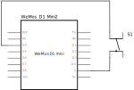
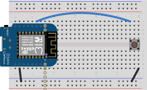

# Lab Exercise - ESP8266 Button

In this lab students will learn about simple on/off (digital) inputs. A digital input is a board pin which can read if it sees a high (on) or low (off) logic level connected to it.  For example if you connect a button to a digital input you can detect when it is pressed and released.

## Exercise 1

#### Components Needed

* push button
* connecting wires
* breadboard
* esp8266 development board (e.g. Wemos D1 mini)

### Instructions

1. Wire up the components as shown in the diagrams.

 

 

2. Open the button.py script and run it. Are button presses detected? Do you notice a problem with the press detection?

3. You can read more on the problem here: https://learn.adafruit.com/make-it-switch/debouncing
