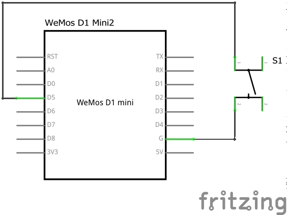
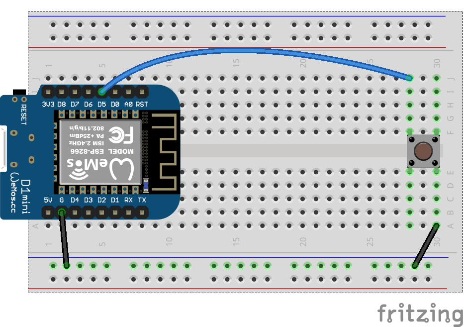
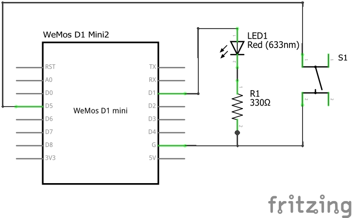
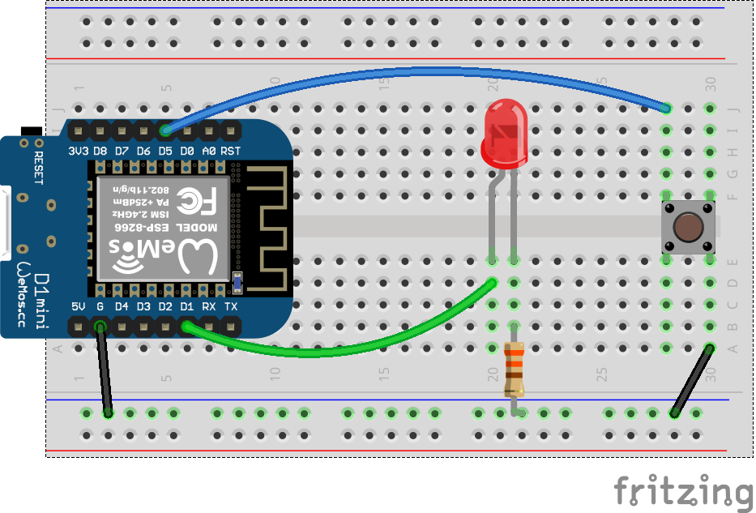

# Lab Exercise - ESP8266 Button

In this lab students will learn about simple on/off (digital) inputs. A digital input is a board pin which can read if it sees a high (on) or low (off) logic level connected to it.  For example if you connect a button to a digital input you can detect when it is pressed and released.


## Exercise 1

#### Components Needed

* push button
* connecting wires
* breadboard
* esp8266 development board (e.g. Wemos D1 mini)

### Instructions

1. Wire up the components as shown in the diagrams.



<br />



<br />

#### Pin Wiring

| Pin No | Function | Device Connection |
| --- | --- | --- |
| G | GND | GND |
| D5 | GPIO14 | Button |


2. Open the button.py script and run it. Are button presses detected? Do you notice a problem with the press detection?

3. You can read more on the problem here: https://learn.adafruit.com/make-it-switch/debouncing

<br />

## Exercise 2

#### Components Needed

* LED
* 330 ohm resistor
* push button
* connecting wires
* breadboard
* esp8266 development board (e.g. Wemos D1 mini)

### Instructions

1. Wire up the components as shown in the diagrams.



<br />



<br />

#### Pin Wiring

| Pin No | Function | Device Connection |
| --- | --- | --- |
| G | GND | GND |
| D5 | GPIO14 | Button |
| D1 | GPIO5 | LED | 


2. Open the LEDbutton.py script and run it. Does the LED turn on when the button is pressed, and off when the button released?

So far, this isn't very interesting. We can do this circuit without the microcontroller. What would be more insteresting would be if we can toggle the led on/off.

3. Modify the LEDbutton.py script so that the LED toggles on and off when the button is pressed. You can use the following code as the bases of your modification:

    ```python
    while True:
        if not button.value():
            led.value(not led.value())  # take the current value of the led output,
                                        # invert it, and make that the new value of
                                        # led.
            time.sleep(.5)
    ```

<br />

## Advanced: Exercise 3

An LED toggling on/off also isn't that interesting. What would be more interesting would be if the LED blinked! when toggled on.

1. Create a script that uses a button to toggle an LED on/off. When the LED is on, it should blink.
